# Домашнее задание "Основы работы с Terraform"
## Задание 1
1. Изучите проект. В файле variables.tf объявлены переменные для Yandex provider.
2. Создайте сервисный аккаунт и ключ. service_account_key_file.

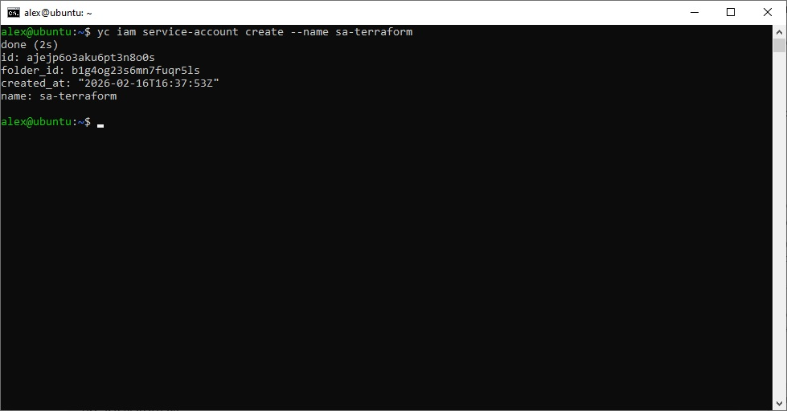

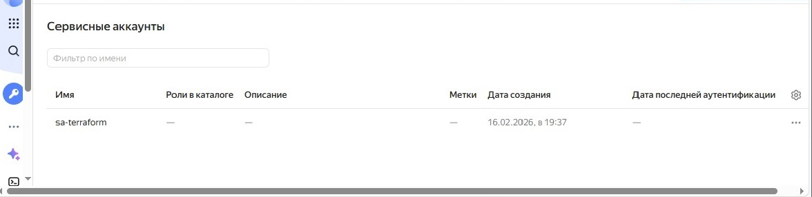

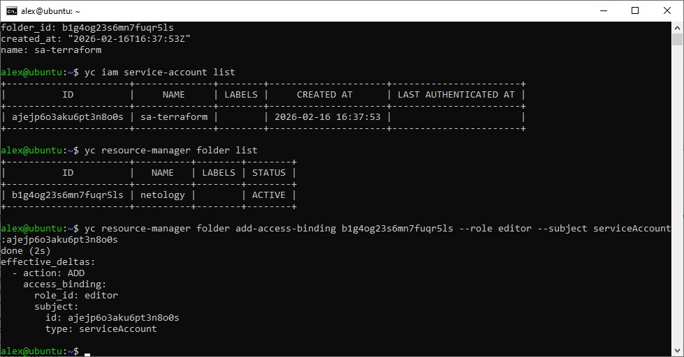

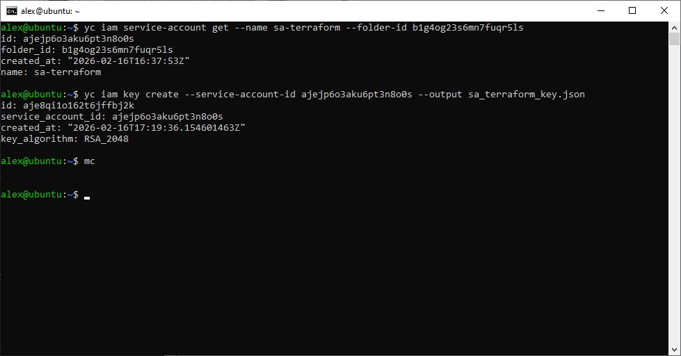

3. Сгенерируйте новый или используйте свой текущий ssh-ключ. Запишите его открытую(public) часть в переменную vms_ssh_public_root_key.

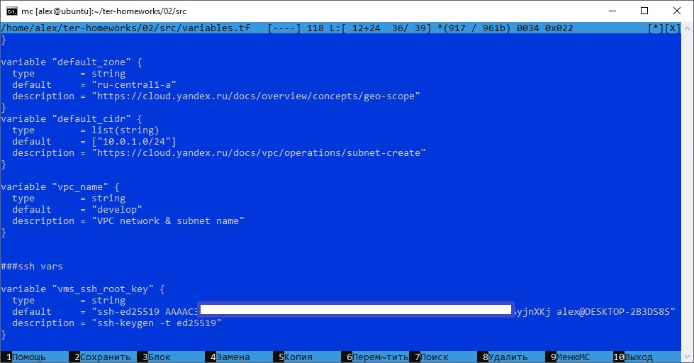

4. Инициализируйте проект, выполните код. Исправьте намеренно допущенные синтаксические ошибки. Ищите внимательно, посимвольно. Ответьте, в чём заключается их суть.

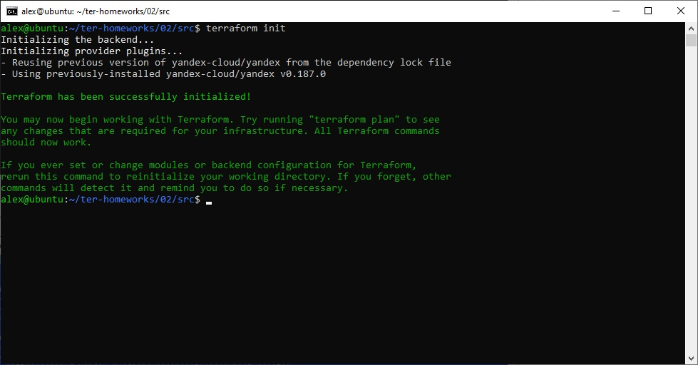

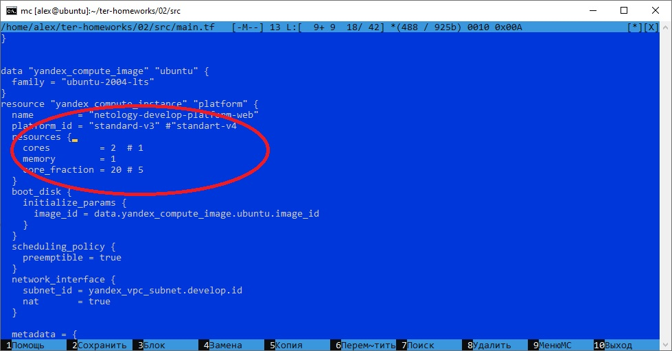

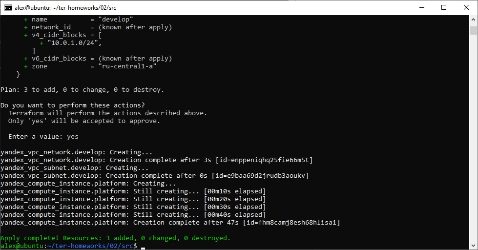

Исправление:

Вместо: standart-v4 замена: standard-v3

Вместо: cores = 1 замена: cores = 2

Вместо: core_fraction = 5 замена: core_fraction = 20

Т.к. для Платформы Intel Ice Lake (standard-v3):

Мин. уровень производительности равен 20%

Мин. количество vCPU равно 2

Мин. количество RAM равно 1

Следует из документации: https://yandex.cloud/ru/docs/compute/concepts/performance-levels

5. Подключитесь к консоли ВМ через ssh и выполните команду  curl ifconfig.me. Примечание: К OS ubuntu "out of a box, те из коробки" необходимо подключаться под пользователем ubuntu: "ssh ubuntu@vm_ip_address". Предварительно убедитесь, что ваш ключ добавлен в ssh-агент: eval $(ssh-agent) && ssh-add Вы познакомитесь с тем как при создании ВМ создать своего пользователя в блоке metadata в следующей лекции.;

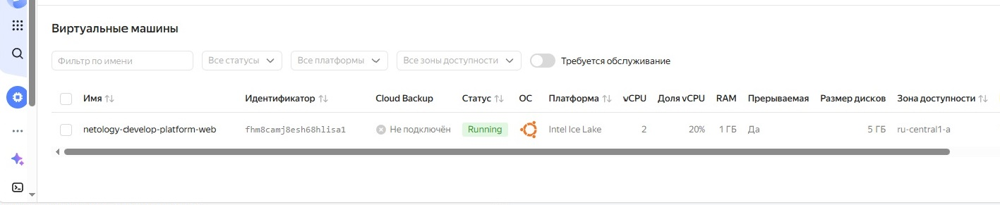

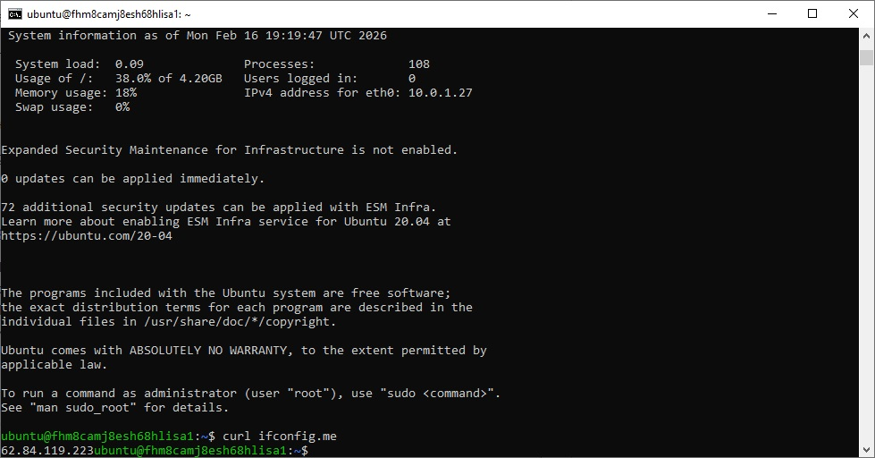

6. Ответьте, как в процессе обучения могут пригодиться параметры preemptible = true и core_fraction=5 в параметрах ВМ.

preemptible = true активирует режим прерываемой виртуальной машины, что позволяет существенно сэкономить средства во время обучения, снижая общую стоимость VM.

core_fraction = 5 — ещё один способ оптимизации расходов на VM.

## Задание 2
1. Замените все хардкод-значения для ресурсов yandex_compute_image и yandex_compute_instance на отдельные переменные. К названиям переменных ВМ добавьте в начало префикс vm_web_ . Пример: vm_web_name.

main.tf
```
resource "yandex_vpc_network" "develop" {
  name = var.vpc_name
}
resource "yandex_vpc_subnet" "develop" {
  name           = var.vpc_name
  zone           = var.default_zone
  network_id     = yandex_vpc_network.develop.id
  v4_cidr_blocks = var.default_cidr
}


data "yandex_compute_image" "ubuntu" {
  family = var.vm_web_family
}
resource "yandex_compute_instance" "platform" {
  name        = var.vm_web_name
  platform_id = var.vm_web_platform_id
  resources {
    cores         = var.vm_web_cores
    memory        = var.vm_web_memory
    core_fraction = var.vm_web_core_fraction
  }
  boot_disk {
    initialize_params {
      image_id = data.yandex_compute_image.ubuntu.image_id
    }
  }
  scheduling_policy {
    preemptible = var.vm_web_preemptible
  }
  network_interface {
    subnet_id = yandex_vpc_subnet.develop.id
    nat       = var.vm_web_nat
  }

  metadata = {
    serial-port-enable = var.vm_web_serial-port-enable
    ssh-keys           = "ubuntu:${var.vms_ssh_root_key}"
  }

}
```
  
2. Объявите нужные переменные в файле variables.tf, обязательно указывайте тип переменной. Заполните их default прежними значениями из main.tf.

variables.tf
```
###cloud vars


variable "cloud_id" {
  type        = string
  description = "https://cloud.yandex.ru/docs/resource-manager/operations/cloud/get-id"
}

variable "folder_id" {
  type        = string
  description = "https://cloud.yandex.ru/docs/resource-manager/operations/folder/get-id"
}

variable "default_zone" {
  type        = string
  default     = "ru-central1-a"
  description = "https://cloud.yandex.ru/docs/overview/concepts/geo-scope"
}
variable "default_cidr" {
  type        = list(string)
  default     = ["10.0.1.0/24"]
  description = "https://cloud.yandex.ru/docs/vpc/operations/subnet-create"
}

variable "vpc_name" {
  type        = string
  default     = "develop"
  description = "VPC network & subnet name"
}


###ssh vars

variable "vms_ssh_root_key" {
  type        = string
  default     = "ssh-ed25519 AAAAC3NzaC1lZDI1NTE5AAAAIOp84Th8BuBH1OIhPhU0uS/36wKmrq+0nkZZZSyjnXKj alex@DESKTOP-2B3DS8S"
  description = "ssh-keygen -t ed25519"
}

###vm_web

variable "vm_web_family" {
  type        = string
  default     = "ubuntu-2004-lts"
  description = "Image ID"
}

variable "vm_web_name" {
  type        = string
  default     = "netology-develop-platform-web"
  description = "VM Name"
}

variable "vm_web_platform_id" {
  type        = string
  default     = "standard-v3"
  description = "Platform ID"
}

variable "vm_web_cores" {
  type = number
  default = 2
  description = "vCPU VM"
}

variable "vm_web_memory" {
  type = number
  default = 1
  description = "RAM VM"
}

variable "vm_web_core_fraction" {
  type = number
  default = 20
  description = "% vCPU"
}

variable "vm_web_preemptible" {
  type = bool
  default = true
  description = "Preemptible VM"
}

variable "vm_web_nat" {
  type = bool
  default = true
  description = "Use NAT"
}

variable "vm_web_serial-port-enable" {
  type = number
  default = 1
  description = "Activate serial port"
}
```
3. Проверьте terraform plan. Изменений быть не должно.

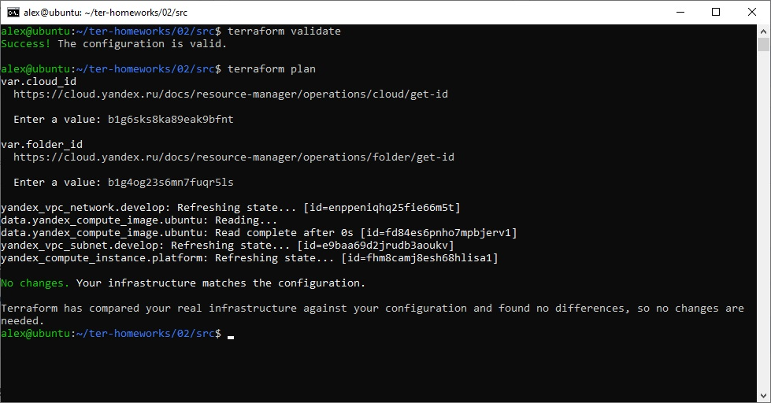

## Задание 3
1. Создайте в корне проекта файл 'vms_platform.tf' . Перенесите в него все переменные первой ВМ.

vms_platform.tf 
```
###cloud vars

variable "vm_db_zone" {
  type        = string
  default     = "ru-central1-b"
  description = "Zone VM"
}

variable "default_zone_db" {
  type        = string
  default     = "ru-central1-b"
  description = "https://cloud.yandex.ru/docs/overview/concepts/geo-scope"
}

variable "default_cidr_db" {
  type        = list(string)
  default     = ["10.0.2.0/24"]
  description = "https://cloud.yandex.ru/docs/vpc/operations/subnet-create"
}

variable "vpc_name_db" {
  type        = string
  default     = "develop_db"
  description = "VPC network & subnet name"
}

###vm_db

variable "vm_db_family" {
  type        = string
  default     = "ubuntu-2004-lts"
  description = "Image ID"
}

variable "vm_db_name" {
  type        = string
  default     = "netology-develop-platform-db"
  description = "VM Name"
}

variable "vm_db_platform_id" {
  type        = string
  default     = "standard-v3"
  description = "Platform ID"
}

variable "vm_db_cores" {
  type = number
  default = 2
  description = "vCPU VM"
}

variable "vm_db_memory" {
  type = number
  default = 2
  description = "RAM VM"
}

variable "vm_db_core_fraction" {
  type = number
  default = 20
  description = "% vCPU"
}

variable "vm_db_preemptible" {
  type = bool
  default = true
  description = "Preemptible VM"
}

variable "vm_db_nat" {
  type = bool
  default = true
  description = "Use NAT"
}

variable "vm_db_serial-port-enable" {
  type = number
  default = 1
  description = "Activate serial port"
}
```
2. Скопируйте блок ресурса и создайте с его помощью вторую ВМ в файле main.tf: "netology-develop-platform-db" , cores  = 2, memory = 2, core_fraction = 20. Объявите её переменные с префиксом vm_db_ в том же файле ('vms_platform.tf'). ВМ должна работать в зоне "ru-central1-b"

main.tf 
```
resource "yandex_vpc_network" "develop" {
  name = var.vpc_name
}

resource "yandex_vpc_subnet" "develop" {
  name           = var.vpc_name
  zone           = var.default_zone
  network_id     = yandex_vpc_network.develop.id
  v4_cidr_blocks = var.default_cidr
}

resource "yandex_vpc_subnet" "develop_db" {
  name           = var.vpc_name_db
  zone           = var.default_zone_db
  network_id     = yandex_vpc_network.develop.id
  v4_cidr_blocks = var.default_cidr_db
}

data "yandex_compute_image" "ubuntu" {
  family = var.vm_web_family
}

resource "yandex_compute_instance" "platform" {
  name        = var.vm_web_name
  platform_id = var.vm_web_platform_id
  resources {
    cores         = var.vm_web_cores
    memory        = var.vm_web_memory
    core_fraction = var.vm_web_core_fraction
  }
  boot_disk {
    initialize_params {
      image_id = data.yandex_compute_image.ubuntu.image_id
    }
  }
  scheduling_policy {
    preemptible = var.vm_web_preemptible
  }
  network_interface {
    subnet_id = yandex_vpc_subnet.develop.id
    nat       = var.vm_web_nat
  }

  metadata = {
    serial-port-enable = var.vm_web_serial-port-enable
    ssh-keys           = "ubuntu:${var.vms_ssh_root_key}"
  }

}

resource "yandex_compute_instance" "platform_db" {
  name        = var.vm_db_name
  platform_id = var.vm_db_platform_id
  zone        = var.vm_db_zone
  resources {
    cores         = var.vm_db_cores
    memory        = var.vm_db_memory
    core_fraction = var.vm_db_core_fraction
  }
  boot_disk {
    initialize_params {
      image_id = data.yandex_compute_image.ubuntu.image_id
    }
  }
  scheduling_policy {
    preemptible = var.vm_db_preemptible
  }
  network_interface {
    subnet_id = yandex_vpc_subnet.develop_db.id
    nat       = var.vm_db_nat
  }

  metadata = {
    serial-port-enable = var.vm_db_serial-port-enable
    ssh-keys           = "ubuntu:${var.vms_ssh_root_key}"
  }

}
```
3. Примените изменения.

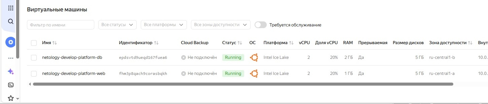

## Задание 4
1. Объявите в файле outputs.tf один output , содержащий: instance_name, external_ip, fqdn для каждой из ВМ в удобном лично для вас формате.(без хардкода!!!)
```
output "vm_info" {
  description = "instance_name, external_ip, fqdn для каждой из ВМ"
  value = {
    platform_db = {
      instance_name = yandex_compute_instance.platform_db.name
      external_ip   = yandex_compute_instance.platform_db.network_interface[0].nat_ip_address
      fqdn          = yandex_compute_instance.platform_db.fqdn
    }
    platform = {
      instance_name = yandex_compute_instance.platform.name
      external_ip   = yandex_compute_instance.platform.network_interface[0].nat_ip_address
      fqdn          = yandex_compute_instance.platform.fqdn
    }
  }
}
```
3. Примените изменения.
В качестве решения приложите вывод значений ip-адресов команды terraform output.

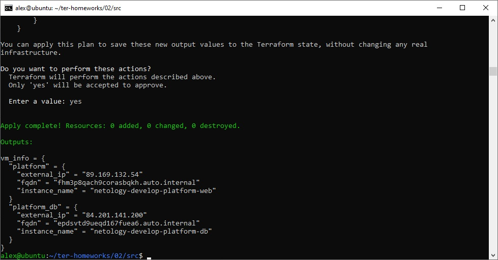

## Задание 5
1. В файле locals.tf опишите в одном local-блоке имя каждой ВМ, используйте интерполяцию ${..} с НЕСКОЛЬКИМИ переменными по примеру из лекции.
```
locals {
    instance = "dev-platform"
    web      = "web"
    db       = "db"
    vm_web = "${local.instance}-${local.web}"
    vm_db = "${local.instance}-${local.db}"
}
```
2. Замените переменные внутри ресурса ВМ на созданные вами local-переменные.
3. Примените изменения.

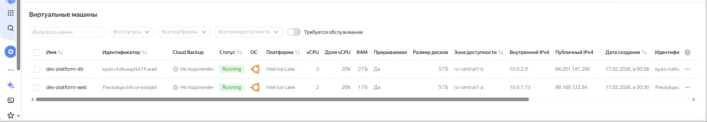

## Задание 6
1. Вместо использования трёх переменных ".._cores",".._memory",".._core_fraction" в блоке resources {...}, объедините их в единую map-переменную vms_resources и внутри неё конфиги обеих ВМ в виде вложенного map(object).
```
пример из terraform.tfvars:
vms_resources = {
  web={
    cores=2
    memory=2
    core_fraction=5
    hdd_size=10
    hdd_type="network-hdd"
    ...
  },
  db= {
    cores=2
    memory=4
    core_fraction=20
    hdd_size=10
    hdd_type="network-ssd"
    ...
  }
}
```
Добавим в vms_platform.tf
```
variable "vms_resources" {

    description = "VMS resources"

    type = map(object({
        platform_id    = string
        cores          = number
        memory         = number
        core_fraction  = number
    }))

    default = {
        web = {
            platform_id   = "standard-v3"
            cores         = 2
            memory        = 1
            core_fraction = 20
        },
        db = {
            platform_id   = "standard-v3"
            cores         = 2
            memory        = 2
            core_fraction = 20
        }
    }
}
```
2. Создайте и используйте отдельную map(object) переменную для блока metadata, она должна быть общая для всех ваших ВМ.
```
пример из terraform.tfvars:
metadata = {
  serial-port-enable = 1
  ssh-keys           = "ubuntu:ssh-ed25519 AAAAC..."
}
```
Добавим в variables.tf
```
variable "instance_metadata" {
  description = "Metadata profiles for instances (web/db)."
  type = map(object({
    serial_port_enable = number
    ssh_keys           = string
  }))

  default = {
    web = {
      serial_port_enable = 1
      ssh_keys           = "ubuntu:ssh-ed25519 AAAAC3NzaC1lZDI1NTE5AAAAIOp84Th8BuBH1OIhPhU0uS/36wKmrq+0nkZZZSyjnXKj alex@DESKTOP-2B3DS8S"
    }
    db = {
      serial_port_enable = 1
      ssh_keys           = "ubuntu:ssh-ed25519 AAAAC3NzaC1lZDI1NTE5AAAAIOp84Th8BuBH1OIhPhU0uS/36wKmrq+0nkZZZSyjnXKj alex@DESKTOP-2B3DS8S"
    }
  }
}
```
3. Найдите и закоментируйте все, более не используемые переменные проекта.
4. Проверьте terraform plan. Изменений быть не должно.

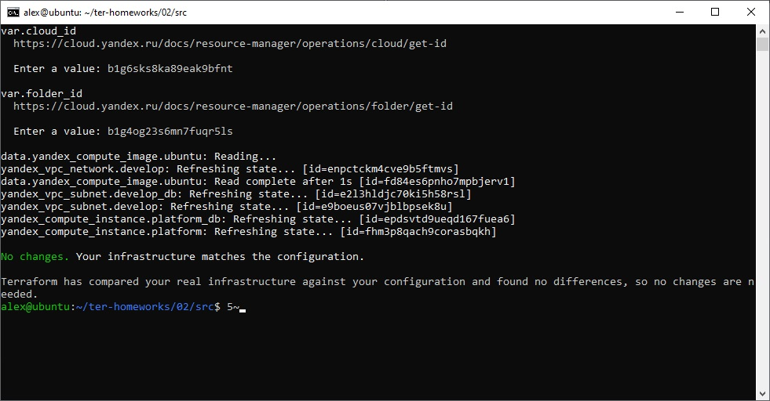

## Задание 7*
Изучите содержимое файла console.tf. Откройте terraform console, выполните следующие задания:

1. Напишите, какой командой можно отобразить второй элемент списка test_list.
```
> local.test_list[1]
"staging"
```
2. Найдите длину списка test_list с помощью функции length(<имя переменной>).
```
> length(local.test_list)
3
```
3. Напишите, какой командой можно отобразить значение ключа admin из map test_map.
```
> local.test_map.admin
"John"
```
4. Напишите interpolation-выражение, результатом которого будет: "John is admin for production server based on OS ubuntu-20-04 with X vcpu, Y ram and Z virtual disks", используйте данные из переменных test_list, test_map, servers и функцию length() для подстановки значений.
```
> "${local.test_map.admin} is admin for ${local.test_list[2]} server based on OS ${local.servers.stage.image} with ${local.servers.stage.cpu} vcpu, ${local.servers.stage.ram} ram and ${length(local.servers.stage.disks)} virtual disks"
"John is admin for production server based on OS ubuntu-20-04 with 4 vcpu, 8 ram and 2 virtual disks"
```
Примечание: если не догадаетесь как вычленить слово "admin", погуглите: "terraform get keys of map"

В качестве решения предоставьте необходимые команды и их вывод.

